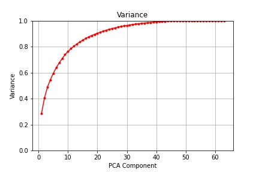
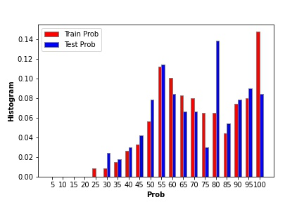

# **Internship at the Basirtech**

Codes, Source, Results and Report of Internship at the Basirtech company.

In this part I'm trying to summerize my report. So please check my report for more detail.

Project contains:
1. PCA
2. SVM
3. Tuning
4. Neural Network
5. Context Shape Descriptor
6. Report

# PCA
I use sklearn digit dataset. My aim was to reduce dimention of these images to get at least 99% variance. Sklearn digit is 8*8 images. With only 39 digits I get 99% variance.

# SVM
Fitting Svm  with RBF kernel to the reduced dimention dataset by PCA and plotting recall and precission. 
- Precission score for train dataset: 1
- Precission score for test dataset: 0.9902
- Recall score for train dataset: 1
- Recall score for test dataset: 0.9907

# Tuning
In this part I use Mnist dataset. I used ⅼibsvⅿ library to implement SVM. Then I evaluate my best classifier with evaluation dataset to accurate the precission. After I finalized my classifier, I predict test dataset. 
- Accuracy for train dataset: 99.37
- Accuracy for test dataset: 98.34

I extract the images with wrong labeled by My final SVM. Most of them was low quality and hard to label by human being. I also create a text file containing name of wrong labeled images and the probability of labeling in these images. I also plot a histogram of these probabilities for train and test dataset.

# Neural Networktrain
